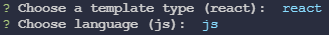

 [NPM]("https://www.npmjs.com/package/create-app-templates")

---

### Install

`npm i -g create-app-templates` or `yarn add -g create-app-templates`

---

Creating app templates

`create-app-templates create app`

Next, you will be asked to select the template of which application you want to create (so far only react is available) and language (so far only js is available):



---

### Available templates and languages

Available templates:

```
react
```


Avaible languages:

```
js
```


---

### Templates

React:

`create-app-templates create react_app`

This command with the choice of template react and js language will create a directory named `react_app` inside the current folder. Inside this directory, it will generate the original project structure and install the transitive dependencies: This command will create a directory named `react_app` inside the current folder. Inside this directory, it will generate the original project structure and install the transitive dependencies:

```
react-app
    -dist
        index.html
    -src
        -components
        -container
        -modules
        -styles
        -utils
        App.jsx
        index.jsx
    webpack.config.js
```

When the project is created, enter the command:

`npm start` or `yarn start`
